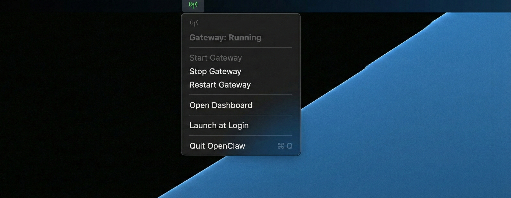

# OpenClaw for macOS

A lightweight macOS menu bar app for managing your [OpenClaw](https://github.com/punkpeye/openclaw) gateway. Start, stop, and monitor your gateway without touching the terminal.




## What it does

OpenClaw for macOS lives in your menu bar and gives you one-click control over the OpenClaw MCP gateway:

- **Status at a glance** — green antenna icon when running, gray when stopped
- **Start / Stop / Restart** the gateway without opening a terminal
- **Open Dashboard** — jump straight to the web UI
- **Launch at Login** — optionally start the app when you log in

## Download

Grab the latest release from the [Releases page](https://github.com/f3r/openclaw-osx-tray/releases/latest) — download `OpenClaw-macos-arm64.zip`, unzip, and move `OpenClaw.app` to your Applications folder.

## Prerequisites

- macOS 13 (Ventura) or later
- [OpenClaw CLI](https://github.com/punkpeye/openclaw) installed via Homebrew:

```bash
brew install punkpeye/openclaw/openclaw
```

## Install

```bash
git clone https://github.com/f3r/openclaw-osx-tray.git
cd openclaw-osx-tray
make install
```

This builds the app, copies it to `~/Applications/OpenClaw.app`, and creates a symlink in `/Applications` so Spotlight and launchers like [OpenTray](https://github.com/nicktrienensfuzz/OpenTray) can find it.

To launch it:

```bash
open ~/Applications/OpenClaw.app
```

Or search for "OpenClaw" in Spotlight / your launcher of choice.

## Uninstall

```bash
make uninstall
```

## Build from source

```bash
make build    # compile and bundle the .app
make run      # build and launch
make clean    # remove build artifacts
```

## How it works

The app polls `http://127.0.0.1:18789` every 5 seconds to check if the gateway is running. All gateway operations (start, stop, restart, dashboard) are delegated to the `openclaw` CLI at `/opt/homebrew/bin/openclaw`.

## License

MIT
